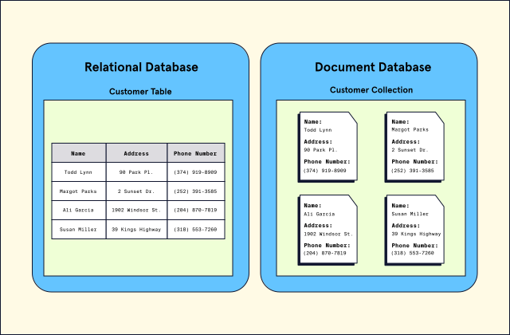

link to codecademy lesson:

https://www.codecademy.com/courses/learn-mongodb/articles/introduction-to-mongo-db

### Introduction to MongoDB

**Learn about MongoDB, a popular document database.**

##### Introduction

By this point, we know that modern databases are systems that allow us to store, organize, and retrieve data. We have examined the characteristics of two main classes of databases: relational (SQL) and non-relational (NoSQL). To recap, at their most basic level, relational databases store data using tables (via rows and columns) and typically work best for heavily organized data. On the other hand, non-relational databases can store data in various ways (e.g., graphs, JSON) and typically work best for unstructured data.

In this article, we will examine a specific type of non-relational database – a document database (also known as a document-oriented database or a document store). More specifically, we will look at MongoDB, one of the most popular document databases. As we start to explore MongoDB, we will learn:

The key characteristics of MongoDB as a document database
The benefits of using MongoDB
Let’s get started!

What is MongoDB?
First released in 2009 and updated regularly with new releases, MongoDB is a database system that allows users to store data using the document model. The document model is a term used to describe a database that primarily stores data in documents and collections. The data stored inside documents is typically stored in hierarchical structures like JSON, BSON, and YAML.

So what exactly do collections and documents look like? Well, take a look over this visualization of the difference between a MongoDB document database and a relational database (e.g., PostgreSQL):

In the above image, the customer information stored in the relational database is stored row by row, inside a table, with each customer possessing the same fields (name, address, phone number). In contrast, the document database has individual documents for each customer. Each of the documents contains a set of fields that may or may not be unique to that customer. Documents are stored inside of a collection.

The document model and several other features we will discuss, make MongoDB a flexible, developer-friendly database used all across the technology landscape. Let’s learn about some more of the unique advantages of using MongoDB.

